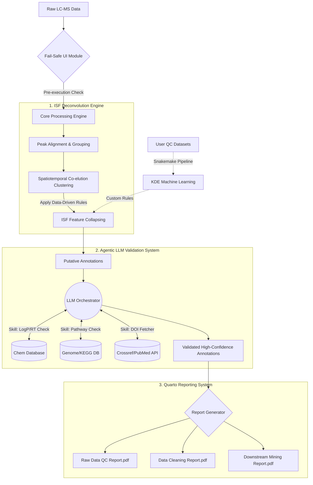

# MetMiner V2: An Agentic, AI-Driven Platform for Robust Plant Metabolomics and ISF Deconvolution

[](#)
[](#)
[](#)

**MetMiner V2** is a next-generation, open-source R platform designed to address the most critical bottlenecks in untargeted LC-MS metabolomics: high false-positive rates caused by In-Source Fragmentation (ISF), workflow fragility, and the lack of biological context in spectral annotation. 

V2 transitions from a traditional static pipeline to an **Agentic AI Workflow**. By equipping Large Language Models (LLMs) with specialized bioinformatic "Skills" (Tool-use), MetMiner V2 acts as a virtual biochemist to rigorously validate metabolite annotations, strictly eliminating AI hallucinations while providing deep biological insights.

## ✨ Key Innovations

### 1. Agentic LLM Annotation Validation (Zero-Hallucination Architecture)
We address the inherent hallucination risks of LLMs by implementing a **Skill-based Agent Architecture**. The LLM is restricted from generating biological facts from its latent weights; instead, it acts as a reasoning engine that invokes strict, API-driven tools:
* **Skill - `Chromatographic_Validator`:** Cross-references predicted LogP/polarity with actual retention times.
* **Skill - `Genomic_Pathway_Check`:** Queries background databases (e.g., KEGG, PlantCyc) to verify if the target species possesses the biosynthetic enzymes for the annotated compound.
* **Skill - `Literature_DOI_Fetcher`:** Mandates Crossref/PubMed API validation for any biological claim, returning only verifiable DOIs. 

### 2. Data-Driven ISF Deconvolution Engine
Complex plant secondary metabolites (e.g., flavonoids, glycosides) frequently undergo source-induced fragmentation, leading to massive feature redundancy.
* **Built-in Plant ISF Dictionary:** Trained via Kernel Density Estimation (KDE) on a massive cohort (>800 QC samples across 10+ plant species) to capture empirical, high-frequency neutral losses (NL) and charged fragments.
* **Spatiotemporal Co-elution Algorithm:** Identifies and collapses highly correlated ($r > 0.95$), co-eluting ISF features into their true precursor ions.
* **Custom Training Pipeline:** Includes a standalone Snakemake workflow for users to train instrument-specific ISF dictionaries from their own QC data.

### 3. Fail-Safe UI & Quarto Automated Reporting
* **Robust Monitoring:** Deep integration of `shinyalert` and `showModal` for pre-execution data validation and real-time process tracking.
* **Automated Quarto Reports:** Generates standardized, publication-ready HTML/PDF reports spanning *Raw Data QC*, *Data Cleaning*, and *Downstream Mining*.

---

## 🧠 System Architecture & Mind Map



---

## 🚀 Installation (Development Version)

```R
# Install dependencies
install.packages(c("devtools", "BiocManager"))
BiocManager::install(c("xcms", "mzR"))

# Install MetMiner V2
# devtools::install_github("xuebinzhang-lab/MetMiner")
```

---

## 📋 V2 Development Roadmap & TODO List

The development of V2 is structured into four distinct phases, prioritizing the stabilization of the Agentic LLM and ISF logic before UI integration.

### Phase 1: Infrastructure & The "Agentic" Core
- [ ] **Define Base R6 Classes for LLM Agents:** Establish the `MetMinerAgent` class structure capable of parsing prompts and managing conversation memory.
- [ ] **Develop Tool/Skill Bindings (R to API):**
  - [ ] `skill_fetch_pubchem_prop()`: Retrieve precise monoisotopic mass and LogP.
  - [ ] `skill_verify_species_pathway()`: Interface with KEGG API to check species-specific module completeness.
  - [ ] `skill_verify_doi()`: Crossref API script to validate literature citations.
- [ ] **Prompt Engineering Guardrails:** Design the system prompt that forces the LLM to use Skills before answering and aggressively penalizes hallucinated DOIs.

### Phase 2: Data-Driven ISF Engine 
- [ ] **Algorithm Implementation (R/Rcpp):** Write the highly optimized sliding-window Pearson correlation matrix calculator for large `massdataset` objects.
- [ ] **KDE Dictionary Training (Python/Snakemake):** Complete the density clustering on the 800+ plant QC cohort to extract the empirical Δm/z dictionary.
- [ ] **Feature Collapsing Logic:** Implement the hierarchical rules (Adducts first -> Neutral Loss -> Diagnostic Fragments) to merge redundant rows in the feature table.
- [ ] **Custom Training Snakemake Wrapper:** Package the Python training scripts into an accessible pipeline for end-users.

### Phase 3: Quarto Reporting & UI Refactoring
- [ ] **UI Error Handling:** Audit all reactive expressions in the Shiny app; wrap high-risk functions with `shinyalert` pre-checks.
- [ ] **Progress Modals:** Implement asynchronous progress tracking (`promises`/`future`) tied to `showModal` to prevent UI freezing during ISF cleaning.
- [ ] **Quarto Templates:** Draft `.qmd` templates for the three core outputs (QC, Cleaning, Downstream) and link them to the `massdataset` standard format.

### Phase 4: Integration, Testing & Documentation
- [ ] **End-to-End Testing:** Run a full raw-to-report pipeline using a benchmark dataset (e.g., maize leaf stress response).
- [ ] **LLM Evaluation:** Benchmark the Agent's false discovery rate by deliberately feeding it biologically impossible metabolite-species pairs.
- [ ] **Vignette Construction:** Write comprehensive tutorials for both the standard GUI usage and the advanced Snakemake ISF training pipeline.

---

## 📄 License & Citation
MetMiner V2 is licensed under the MIT License. 
*(Citation details to be updated upon publication).*